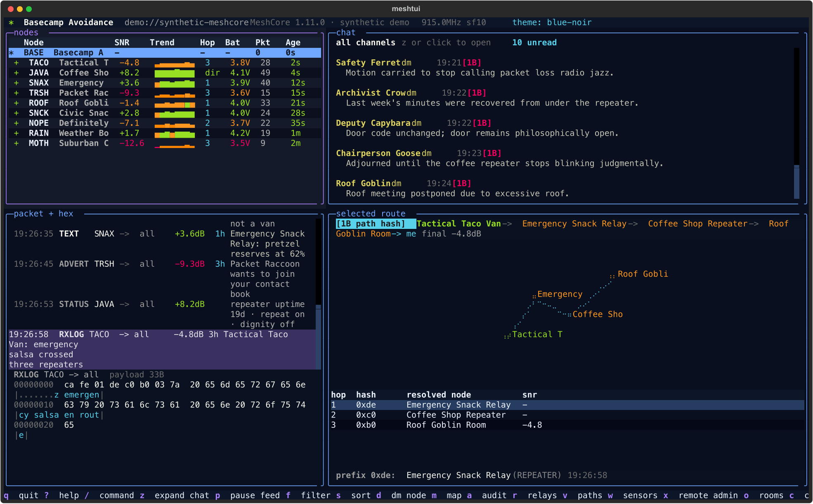
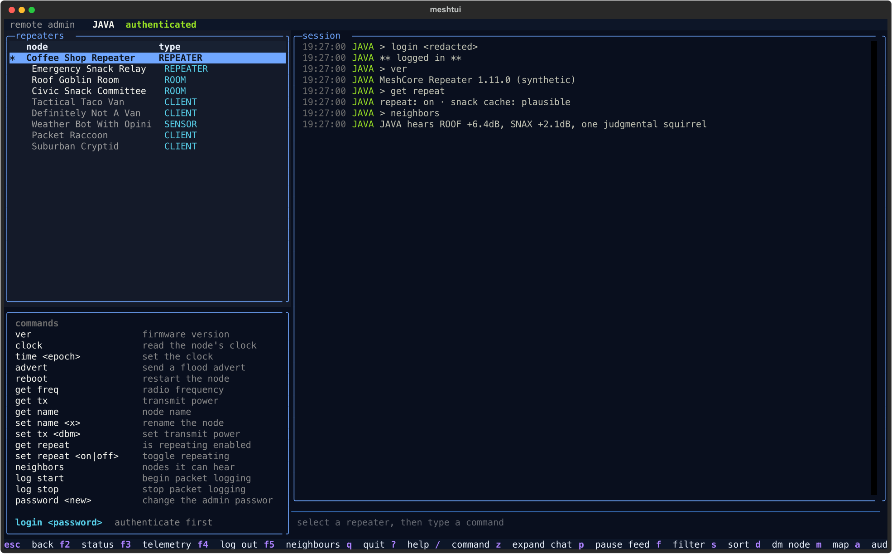
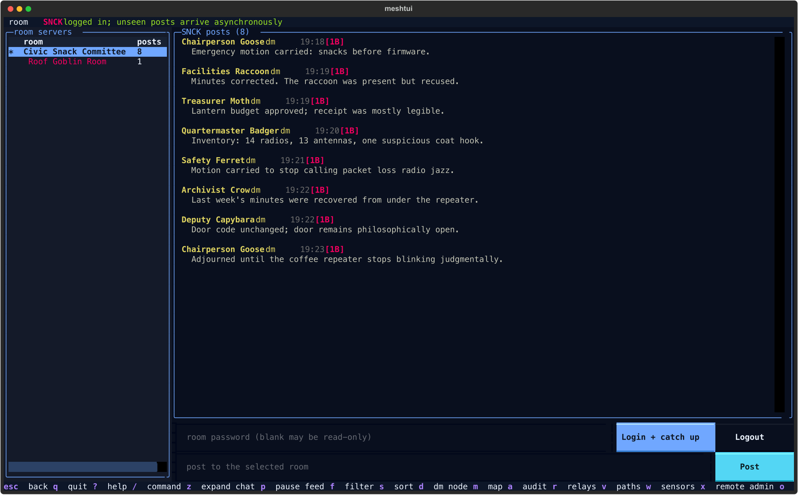
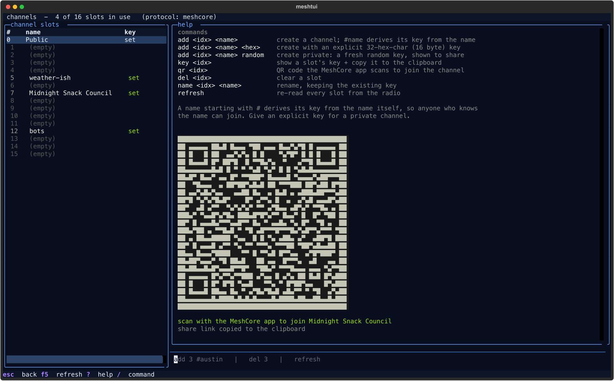
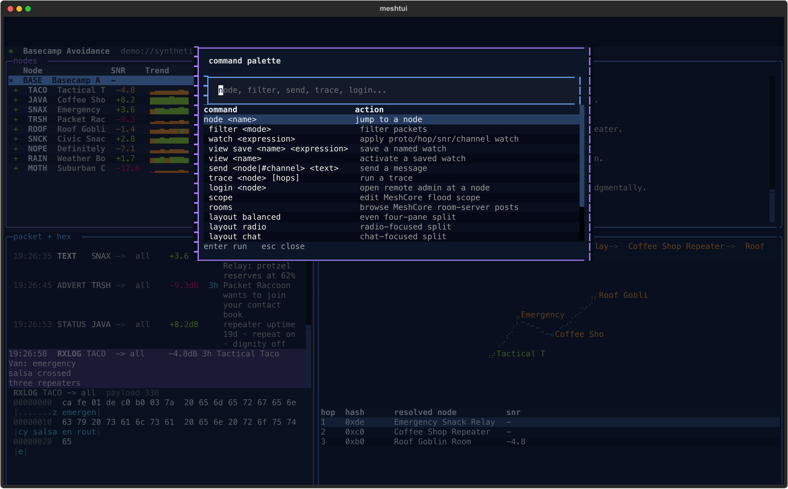
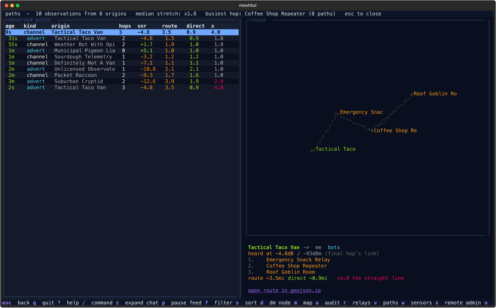
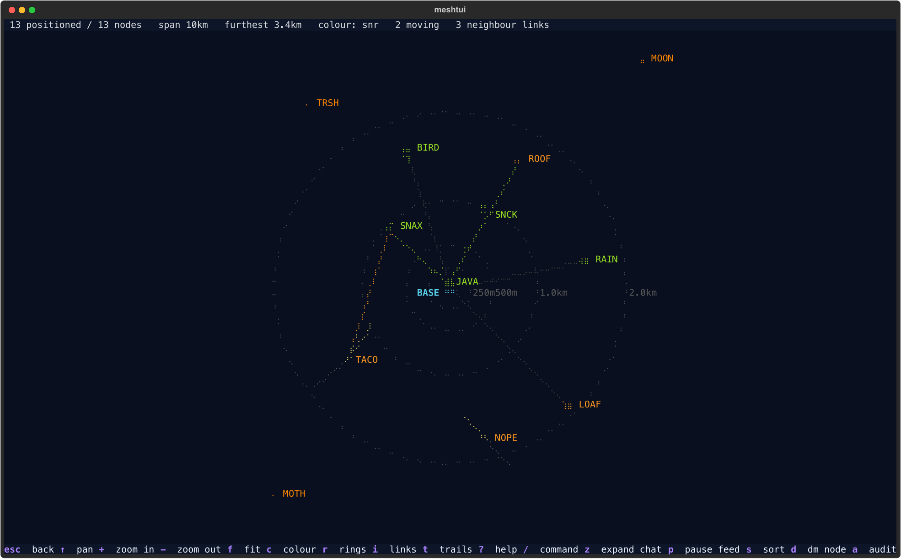
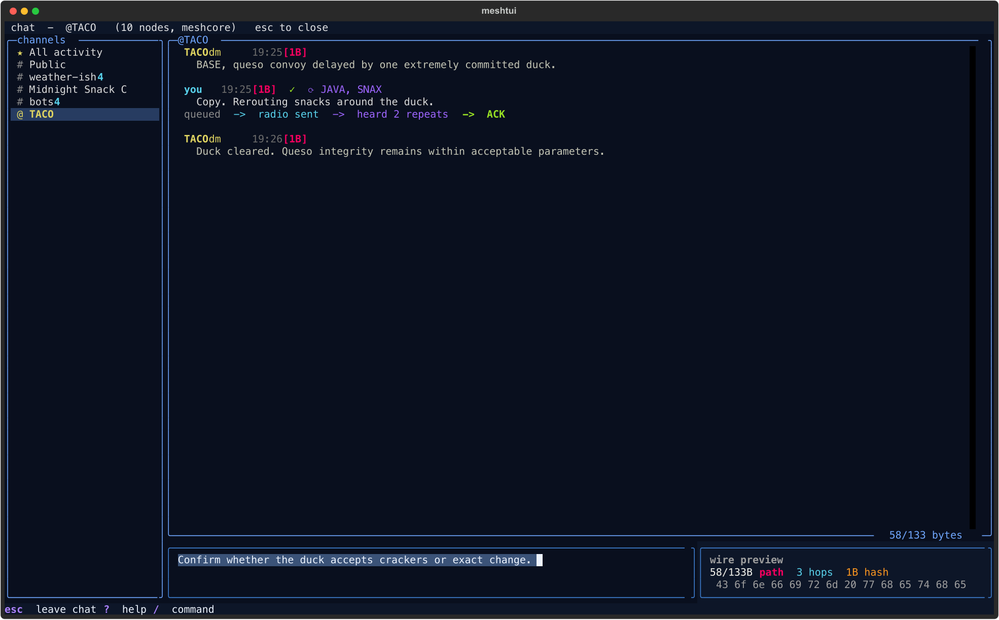
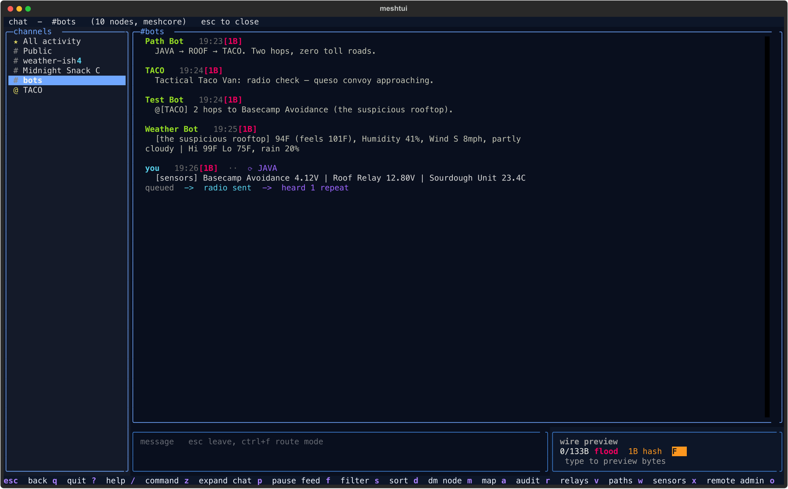
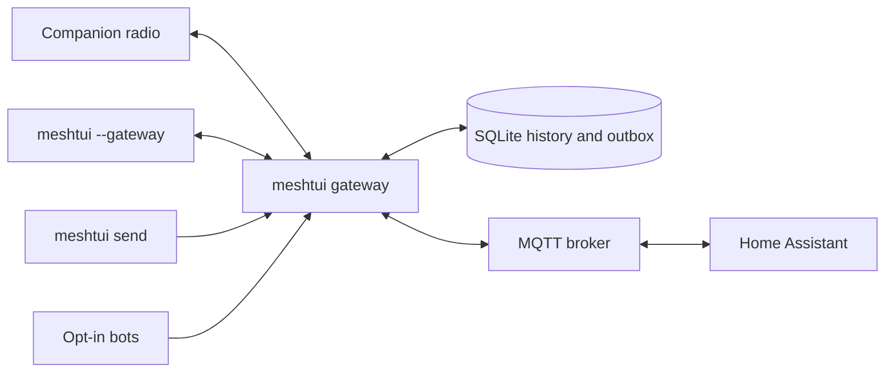

<p align="center">
  
</p>

<h1 align="center">MeshTUI</h1>

<p align="center">
  <strong>A terminal control surface for <a href="https://github.com/meshcore-dev/MeshCore">MeshCore™</a> and <a href="https://meshtastic.org/">Meshtastic®</a>.</strong><br>
  Watch the air. Talk across the mesh. Trace routes. Admin repeaters without climbing onto the roof.
</p>

<p align="center">
  <a href="https://meshtui.com">Website</a>
  ·
  <a href="#quick-start">Quick start</a>
  ·
  <a href="#keyboard-reference">Keys</a>
  ·
  <a href="#unattended-gateway">Gateway</a>
</p>

<p align="center">
  
  
  <a href="LICENSE"></a>
</p>

[](docs/assets/meshtui-dashboard.png)

<p align="center"><em>The real Textual interface, captured with deterministic synthetic MeshCore data. The radios are fictional; the UI is not.</em></p>

MeshTUI turns a companion radio into an operator-friendly terminal application. It
normalizes MeshCore and Meshtastic traffic into one live view while keeping each
protocol's distinctive capabilities visible.

## What you can do

| | Capability |
|---|---|
| **Observe** | Work in four panes—nodes, chat, packet hex, and the selected route—with last-heard heat, SNR sparklines, and rolling one-hour airtime. |
| **Communicate** | Preview wire bytes and route intent before sending. Direct messages can progress from queued → radio sent → repeats → ACK; broadcasts stop at sent and, when available, heard-repeater evidence. |
| **Understand routes** | Select traffic to see its hop chain, map polyline, prefix candidates, and final-link SNR; run traceroute for outbound/return paths and per-hop SNR. |
| **Operate remotely** | Authenticate to MeshCore repeaters, merge neighbour tables into the graph, browse room catch-up, edit flood scope, and manage private radio channels. |
| **Automate** | Keep one gateway on the radio and fan it out to TUI/web clients, MQTT, local plugins, notifications, scheduled weather and sensor posts, bots, map uploads, and teaching replays. |
| **Investigate** | Inspect decoded fields and hex, retain SQLite history, export CSV, review channel exposure in the TUI, and audit captured Meshtastic keys offline. |

## Protocol support

MeshTUI probes serial radios for MeshCore first, then falls back to Meshtastic. You
can always choose explicitly with `--protocol meshcore` or
`--protocol meshtastic`.

| Capability | MeshCore | Meshtastic |
|---|:---:|:---:|
| Dashboard, nodes, packets, chat, direct messages | ✓ | ✓ |
| Position map, telemetry, sensors, history | ✓ | ✓ |
| Channel browsing and payload-aware composer | ✓ | ✓ |
| Create, rename, delete, and share private radio channels | ✓ | — |
| Observed path explorer and route bot | ✓ | — |
| Message repeat attribution | ✓ | — |
| Remote repeater and room-server administration | ✓ | — |
| Traceroute and per-hop SNR | ✓ | ✓ |
| Room post catch-up and flood-scope control | ✓ | — |
| Relay dependency and mesh health | ✓ | ✓ |
| Scheduled weather and sensor posts | ✓ | ✓ |
| Opt-in infrastructure advert map upload | ✓ | — |
| In-app channel audit | ✓ | ✓ |
| Offline captured-channel key audit | — | ✓ |

Protocol-specific features stay protocol-specific. MeshTUI does not pretend that a
MeshCore route is a Meshtastic traceroute, or that a broadcast has an end-to-end
delivery receipt.

## Remote administration

[](docs/assets/meshtui-remote-admin.png)

Press `x` to open the MeshCore administration screen. Select a repeater or room
server, enter `login <password>`, and send the console commands supported by that
node's firmware. Shortcuts request status, telemetry, neighbours, and logout.

Replies travel over LoRa®, so they can take seconds or be lost. The session log
records exactly what returned and survives restarts. Text entered after `login`,
`password`, `passwd`, or `pass` is redacted before it reaches memory or SQLite.

Common commands include `ver`, `clock`, `advert`, `reboot`, `get freq`, `get tx`,
`get repeat`, `set repeat on|off`, `neighbors`, and `log start|stop`. The repeater
firmware remains the authority for the commands a particular build accepts.

Press `o` for the room-server browser. Its password input is masked and never
persisted. Login asks the room to push its unseen retained posts; catch-up is
therefore asynchronous RF traffic rather than an HTTP-style fetch. Signed room
posts remain grouped under the room thread while showing the original author's
resolved public-key prefix. Posts use the same durable outbox as direct messages.

[](docs/assets/meshtui-rooms.png)

Run `scope` from the command palette to inspect the radio default, apply a
session-only `#scope`, save a persistent default, or explicitly force unscoped
flooding. These are separate controls because blank means “use the radio
default,” while `*` deliberately bypasses scope isolation. Flood-routed messages
carry a visible `F` badge.

## MeshCore channel management

Press `c` to browse the channel slots on a MeshCore radio. The same screen can
create, rename, delete, and share channels when the TUI opens the radio directly
or attaches through `meshtui gateway`.

[](docs/assets/meshtui-channels.png)

```text
add 12 Night Shift random
key 12
qr 12
name 12 Night Watch
del 12
refresh
```

Use `random` to generate a fresh 16-byte key for a private channel. `key` shows
the key and asks the terminal to copy it through an OSC 52 clipboard sequence;
if clipboard access is unavailable, MeshTUI leaves the value visible for manual
copying. `qr` displays a phone-scannable MeshCore join code and copies its
`meshcore://` share link. A rename preserves the existing key. The command
`add SLOT NAME KEY` also accepts an existing key as 32 hexadecimal characters.

A channel name beginning with `#` derives its key from the name, so anyone who
knows that name can join. Use a random or explicit 32-hex-character key when the
channel must be private. Treat a displayed key, join link, or QR code as a
credential: do not put it in public screenshots, logs, or issue reports.

## Operator cockpit

The main screen is always a four-pane workspace: nodes, chat, packet/hex, and the
selected route. `l` cycles balanced, radio, chat, and route-biased layouts; `T`
cycles phosphor, night-vision, blue-noir, and high-contrast themes. Both choices
are stored per protocol in `~/.config/meshtui/preferences.json`, so a MeshCore deck and a
Meshtastic station can keep different working arrangements.

Press `/` for the searchable command palette. It exposes the operator vocabulary
without replacing the populated cockpit:

[](docs/assets/meshtui-palette.png)

Useful commands include:

```text
node Hilltop
filter text only
watch proto:mc hop>=3 snr<5 chan:#public
view save marginal proto:mc hop>=3 snr<5
view marginal
send #public check in
trace Walker 5
login RidgeRepeater
rooms
scope
layout route
theme blue-noir
theme high-contrast
```

Watch expressions are parsed without `eval`; supported fields are `proto`,
`hop`, `snr`, `chan`, `from`, `to`, `type`, and `text`. Named views, layouts,
and themes remain local operator preferences and are scoped by protocol.

## Route intelligence

Press `v` to open the observed-path ledger. MeshCore traffic becomes a durable
record of its origin, path-hash width, resolved repeaters, age, and final-link
SNR. When the route nodes have positions, the ledger also calculates distance
and route stretch. Selecting a route draws its hop chain; selecting a hop reveals
the public-key prefix candidates that could have carried it.

[](docs/assets/meshtui-paths.png)

Traceroute is kept distinct from passive observation. A completed trace can show
outbound and return paths with per-hop SNR when the radio reports it; a received
packet supplies only the final-link SNR.

Press `m` to open the braille position map. Positioned nodes can be shown with
range rings, direct links, authenticated repeater-neighbour edges, movement
tracks, and headings. The map can colour nodes by SNR, hop count, or last-heard
age and supports keyboard pan, zoom, fit, and layer controls.

[](docs/assets/meshtui-map.png)

## Chat that behaves like a chat client

[](docs/assets/meshtui-chat.png)

The dashboard shows an all-channel activity stream. Press `z` for focused chat;
`/` opens the operator command palette. MeshTUI provides:

- separate channel and direct-message conversations;
- unread counts and channel navigation;
- Tab-completed `@[Name]` mentions, including emoji-led names;
- a live UTF-8 byte budget for the active protocol;
- a split wire preview with expected hops and path-hash width when a learned
  route is known, plus auto/flood/direct mode;
- a direct-message queued → sent → heard-repeaters → ACK receipt timeline,
  while broadcasts stop at sent and, when available, heard-repeater evidence; and
- MeshCore repeater attribution on sent channel messages.

The composer refuses an over-limit payload without discarding the draft. The
current fallback limits are 233 bytes for Meshtastic and 133 bytes for MeshCore;
when the installed Meshtastic protobuf exposes its own limit, MeshTUI uses that
value.

## Bots without a bot-shaped security hole

[](docs/assets/meshtui-bots.png)

The unattended gateway can host opt-in responders and scheduled publishers:

- `--pathbot CHANNEL` answers `!path` from MeshCore's recorded RF route data.
- `--testbot CHANNEL` returns the observed hop count for a field-test message.
  Repeat the option to serve multiple test channels.
- `--weatherbot CHANNEL` posts current weather and the day's forecast at the
  local times set by `--weatherbot-times`.
- `--sensorbot CHANNEL` posts a digest of recently heard environmental and
  infrastructure power telemetry at the interval set by `--sensorbot-minutes`.
- `--bot-channel CHANNEL` sends explicit `@ai` requests to a
  Responses-compatible text provider.

The AI router receives only the prompt, sender ID, and conversation label. It has
no tools, files, shell, radio credentials, or database history. Replies are
rate-limited, duplicate-suppressed across restarts, UTF-8 safe, and capped at three
mesh packets.

```sh
export OPENAI_API_KEY='...'

meshtui gateway --protocol meshcore --port /dev/ttyUSB0 \
  --pathbot '#bots' \
  --testbot '#testing' --testbot '#night-shift' \
  --testbot-location 'the suspicious rooftop' \
  --weatherbot '#weather' --weatherbot-times '07:00,18:00' \
  --sensorbot 'Private Sensors' --sensorbot-minutes 60 \
  --bot-channel '#bots' --ai-model gpt-5-mini
```

WeatherBot needs the gateway's advertised position and outbound Internet access.
At each configured time it sends that latitude and longitude, rounded to four
decimal places, to Open-Meteo and posts at most one mesh message. Missed schedule
windows are skipped instead of replayed later. `--testbot-location` labels both
test receipts and weather reports. SensorBot makes no Internet request and
requests no additional RF telemetry; it summarizes data the gateway has already
heard and posts at most one message per interval, with a five-minute minimum.
Node labels and sensor readings can still be sensitive, so prefer a private
channel for sensor digests.

The path, test, and sensor bots are deterministic and local; they do not need an
API key. Every bot reply or scheduled post consumes real LoRa airtime. Choose
quiet channels and conservative schedules, especially on a busy mesh.

## Quick start

The fastest way to explore MeshTUI does not require a repository checkout or a
radio. The public installer is readable at
[meshtui.com/install.sh](https://meshtui.com/install.sh), does not use `sudo`,
and prints the exact executable path when it finishes:

```sh
curl -fsSL https://meshtui.com/install.sh | bash
~/.local/bin/meshtui --demo
```

If the installer prints a different path, use that path instead. To connect real
hardware, attach a companion radio over USB and run:

```sh
~/.local/bin/meshtui
```

If a live gateway answers on the default owner socket, plain `meshtui` attaches
to it automatically instead of competing for the radio. Otherwise, MeshTUI
auto-detects the serial device and protocol. An explicit `--port`, `--host`, or
`--demo` choice always takes precedence. If more than one device is present, or
you want an explicit configuration:

```sh
~/.local/bin/meshtui --list-ports
~/.local/bin/meshtui --port /dev/ttyUSB0 --protocol meshcore
~/.local/bin/meshtui --port /dev/ttyACM0 --protocol meshtastic
```

### Run from a source checkout

[uv](https://docs.astral.sh/uv/) installs the required Python version and locked
dependencies for development:

```sh
git clone https://github.com/jsaveker/meshtui.git
cd meshtui
uv run meshtui --demo
```

### Install without uv

MeshTUI requires Python 3.11 or newer.

```sh
python3 -m venv .venv
source .venv/bin/activate
python -m pip install -e .
meshtui --demo
```

### Connect over TCP

Both transports accept `--host`. This is useful when the radio is positioned for
RF coverage rather than beside the operator:

```sh
meshtui --host 192.168.1.42 --protocol meshtastic
meshtui --host meshtastic.local --protocol meshtastic
meshtui --host 192.168.1.43:5000 --protocol meshcore
```

For Meshtastic, the default TCP port is 4403. Run `meshtui --list-ports` to find
serial devices and Meshtastic nodes advertising over mDNS.

### Useful launch options

```text
--demo                   run with a synthetic mesh and no radio
--gateway [SOCKET]       attach the TUI to a running local gateway
--no-store               keep the session out of SQLite
--db PATH                use a specific database
--restore-limit N        choose how many stored packets rebuild live views
--stats                   print database statistics and exit
--export TABLE:FILE      export packets, messages, or nodes to CSV
--audit                   audit captured Meshtastic channel keys and exit
--debug                   write meshtui.log
```

Run `meshtui --help`, `meshtui gateway --help`, or `meshtui send --help` for the
complete command reference.

## Unattended gateway

`meshtui gateway` is the long-running radio owner. It has no UI, reconnects after
link failure, writes history, and exposes an owner-only local Unix socket. The TUI
and local automation attach to it instead of competing for the serial port.



```sh
# Keep one process attached to the radio.
meshtui gateway --protocol meshcore --port /dev/ttyUSB0

# Inspect it or watch it through the full TUI.
meshtui gateway-status
meshtui --gateway

# Send from a local script without opening the serial device.
meshtui send channel --channel '#bots' 'backup completed; raccoon uninvolved'
meshtui send dm --to '!c0decafe' 'water sensor is dry again'

# Exit successfully only after the direct-message mesh ACK arrives.
meshtui send dm --to '!c0decafe' --wait 300 'field test 0042'
```

With the default socket, running plain `meshtui` also detects the live gateway
and attaches automatically. Pass `--port` or `--host` when you deliberately want
to open a radio directly.

One logical outgoing message is written before transmission. Failed connections
leave it queued, retries retain the same message ID, and process restarts do not
erase the outbox.

The owner-only Unix socket supports multiple simultaneous subscribers. Every TUI,
the browser companion, and local automation sees a consistent snapshot followed
by live events, while only the gateway opens the serial/BLE/TCP radio and writes
SQLite. Trace, room/admin, neighbour, flood-scope, and channel-management
operations are proxied through that same owner rather than reopening the device.

Treat this socket as a privileged local control interface. A client that can open
it can transmit messages, invoke repeater and room operations, change flood
scope, modify radio channels, and retrieve channel keys. The gateway creates the
socket with owner-only permissions, but those permissions cannot protect it after
an unsafe bind mount, file share, or proxy. Do not expose it through an
unauthenticated TCP bridge or grant access to untrusted containers or users.

Delivery states have deliberately narrow meanings:

| State | Meaning |
|---|---|
| `queued` | Durable locally; the radio has not accepted it. |
| `sent` | Accepted by the local radio. This does not prove receipt. |
| `delivered` | A direct-message end-to-end mesh acknowledgement arrived. |
| `failed` / `expired` | Retry or lifetime policy ended the attempt. |

Channel broadcasts stop at `sent`; neither protocol can prove that every listener
received one. Run the gateway under your service manager for a days-long station,
with a fixed database and socket path and serial-device permission. Only one
process can own a radio at a time.

### Containerized gateway and remote TUI

The example Compose service maps one specific serial device into an unprivileged,
read-only container. It persists the database and places the owner-only gateway
socket in a host directory. It does not publish a network port or make the send
API directly reachable from the LAN.

On the Linux host connected to the radio:

```sh
mkdir -p "$PWD/runtime/data" "$PWD/runtime/run"
export MESHTUI_UID="$(id -u)"
export MESHTUI_GID="$(id -g)"
export MESHTUI_RADIO_DEVICE=/dev/serial/by-id/usb-your-radio
export MESHTUI_RADIO_GID="$(stat -c '%g' "$MESHTUI_RADIO_DEVICE")"
export MESHTUI_DATA_DIR="$PWD/runtime/data"
export MESHTUI_RUN_DIR="$PWD/runtime/run"
docker compose -f deploy/compose.gateway.example.yaml up -d --build
docker compose -f deploy/compose.gateway.example.yaml exec gateway \
  meshtui gateway-status --socket /run/meshtui/gateway.sock
```

Keep private MQTT settings, channel names, and credentials in a local Compose
override or environment file outside the repository.

To run the TUI on another computer, forward the Unix socket through SSH. The same
command works over a local address or a private overlay-network address:

```sh
ssh -N -o StreamLocalBindUnlink=yes -o ExitOnForwardFailure=yes \
  -L /tmp/meshtui-remote.sock:/absolute/host/path/runtime/run/gateway.sock \
  gateway-host

# In another terminal on the client:
meshtui gateway-status --socket /tmp/meshtui-remote.sock
meshtui --gateway /tmp/meshtui-remote.sock
```

The SSH login must be able to access the remote socket. Leave the tunnel running
while the TUI is attached; SSH supplies authentication and encryption without
changing the gateway protocol.

### Contribute MeshCore map adverts

The optional map uploader publishes verified, heard, non-chat adverts to the
[official MeshCore map](https://map.meshcore.io/). It ignores chat-node adverts,
verifies each eligible advert's Ed25519 signature, and signs the upload with the
listening radio's identity before sending it over HTTPS.

```sh
meshtui gateway --protocol meshcore --port /dev/ttyUSB0 --map-upload
```

The option is disabled by default and requires firmware that permits private-key
export. The private key remains in the gateway process and is not included in the
upload; the request contains the signed advert, current radio parameters, the
uploader's public key, and its signature. If the identity is unavailable or an
advert fails verification, MeshTUI does not upload it. Enabling this option
intentionally makes eligible heard advert data available to the public map.

### Read-only web companion

`meshtui serve` subscribes to the gateway socket and serves the same nodes,
recent chat, health, and route polylines without opening the radio or database:

```sh
# Safe local default.
meshtui serve --gateway /tmp/meshtui-$(id -u).sock

# Deliberately expose it to the local network.
meshtui serve --listen 0.0.0.0 --port 8765
```

The companion has no send or admin endpoints. It binds to `127.0.0.1` by
default, uses no CDN, and returns a restrictive content-security policy. A LAN
bind is still a disclosure decision: chat, node identifiers, and positions can
be sensitive, so place authentication/reverse-proxy controls in front of it on
an untrusted network.

### Trusted local plugins

Plugins load only when the gateway is explicitly started with `--plugins`
(default directory `~/.config/meshtui/plugins/`) or `--plugins DIR`. Each Python
file may expose `setup(api)` and use three small primitives:

```python
def setup(api):
    @api.on_packet
    def observe(packet):
        print(packet.from_id, packet.portnum, packet.snr)

    @api.on_message
    def reply(message):
        if message.text == "!local-ping":
            api.send("pong", to=message.from_id)
```

`api.send(text, to=...)` and `api.send(text, channel=...)` enter the durable
gateway outbox. Hook exceptions are isolated and reported by `gateway-status`.
Plugins are fully trusted local code—not a sandbox—and nothing in a cloned
repository is auto-loaded.

### Teaching replay

A second read-only “ghost” gateway can replay a bounded time window without
touching the live radio or writing back into the source:

```sh
meshtui replay --db ~/.local/share/meshtui/mesh.db \
  --from 1788200000 --to 1788203600 --speed 10

meshtui replay --pcap field-capture.pcapng --protocol meshcore --speed 4

# In another terminal:
meshtui --gateway /tmp/meshtui-$(id -u)-ghost.sock
```

Classic PCAP and PCAPNG are supported. Meshtastic replay accepts raw
`MeshPacket`, `FromRadio`, serial-framed, and UDP/TCP payload captures. MeshCore
replay accepts raw RF frames; specify `--protocol meshcore` when the link-layer
capture is otherwise ambiguous. Capture timestamps are preserved relatively and
rebased to replay time. The ghost rejects every send.

### Notifications

Named-node reappearance and trace failures can fan out to the local desktop,
an ntfy server, and/or the configured MQTT broker:

```sh
meshtui gateway --protocol meshcore --port /dev/ttyUSB0 \
  --notify-node 'Walker*' --notify-node '!aabbccdd' \
  --notify-trace-fail --notify-desktop \
  --ntfy-topic mesh-ops --ntfy-token-env MESHTUI_NTFY_TOKEN
```

Rules are disabled by default, node names accept shell-style wildcards, and the
active window prevents repeat notifications for a node that never actually
left. Delivery runs off the radio callback thread. An MQTT-configured gateway
also emits these as non-retained generic events for Home Assistant automations.

### Home Assistant telemetry over MQTT

The gateway can publish the telemetry it already stores as retained MQTT state
and Home Assistant discovery documents. This is an optional extra; the public
project contains no broker address, credentials, private node IDs, or household
entity names.

```sh
# Install the optional broker client.
uv sync --extra mqtt

# Keep the password in a protected service environment. For a one-off Bash
# session, prompt without putting it in shell history or the process command.
read -rsp 'MQTT password: ' MESHTUI_MQTT_PASSWORD && echo
export MESHTUI_MQTT_PASSWORD

meshtui gateway --protocol meshcore --port /dev/ttyUSB0 \
  --mqtt-host mqtt.example.lan \
  --mqtt-username meshtui \
  --mqtt-password-env MESHTUI_MQTT_PASSWORD \
  --mqtt-gateway-id field-station
```

Once Home Assistant's MQTT integration is connected to that broker, its default
`homeassistant` discovery prefix creates one device per mesh node. Available
entities include last-heard age, active state, SNR, RSSI, hops, battery, voltage,
channel utilization, transmit airtime, packet count, environmental readings,
and protocol-specific local statistics. Discovery, state, and the gateway's
`online`/`offline` availability are retained so Home Assistant and the broker can
restart independently.

Coordinates are excluded by default. Add `--mqtt-include-position` only when the
broker and every subscriber are trusted. TLS is available through `--mqtt-tls`
and `--mqtt-ca FILE`; `--mqtt-prefix`, `--ha-discovery-prefix`, and
`--mqtt-active-seconds` make topic and aging policy deployment-specific without
forking the code.

For platform consumers, `--mqtt-events` adds non-retained
`events/packet`, `events/message`, `events/receipt`, and `events/gateway` topics.
This is separate from retained Home Assistant state because it includes message
content. The event stream is normalized and deliberately excludes raw radio
payload dictionaries, but it should still be enabled only for trusted brokers
and subscribers.

### Home Assistant notifications to a mesh channel

MQTT-to-radio sends are a separate opt-in. Repeat `--mqtt-send-channel` for
each channel that broker clients may use; with no allowlist, the gateway does
not subscribe to a send topic and MQTT cannot key the radio.

```sh
meshtui gateway --protocol meshcore --port /dev/ttyUSB0 \
  --mqtt-host mqtt.example.lan \
  --mqtt-username meshtui \
  --mqtt-password-env MESHTUI_MQTT_PASSWORD \
  --mqtt-gateway-id field-station \
  --mqtt-send-channel '#alerts'
```

For every allowlisted channel, Home Assistant discovery creates a native
`notify` entity. An automation can target it with the standard notification
action:

```yaml
- action: notify.send_message
  target:
    entity_id: notify.meshtui_field_station_alerts
  data:
    message: "Backup power is active"
```

The entity ID follows the configured gateway and channel names; confirm the
actual ID on the MQTT device page before using it. Keep entity IDs and message
templates for a particular building in that private Home Assistant instance,
not in a public checkout.

The raw command topic is `<prefix>/<gateway-id>/send`. Plain text goes to the
first allowlisted channel. JSON can select one explicitly:

```json
{"channel":"alerts","text":"Backup power is active"}
```

This path is designed for compact, low-volume automation results. Requests to
other channels, empty or malformed structured requests, and messages arriving
faster than `--mqtt-send-seconds` are dropped. Accepted text is truncated on a
UTF-8 boundary to the radio protocol's frame limit. MeshCore text frames carry
at most 133 UTF-8 bytes, which is not necessarily 133 characters. Use QoS 0 and
never retain command messages: reconnecting clients must not replay an old
alert onto RF.

You can also send a periodic summary of selected Home Assistant sensors while
keeping the selection private. Replace these placeholder entity IDs only in
your Home Assistant automation:

```yaml
alias: Mesh hourly indoor climate summary
triggers:
  - trigger: time_pattern
    minutes: "5"
conditions: []
actions:
  - action: notify.send_message
    target:
      entity_id: notify.meshtui_field_station_alerts
    data:
      message: >-
        Indoor {{ states('sensor.indoor_temperature') }}
        {{ state_attr('sensor.indoor_temperature', 'unit_of_measurement') }};
        RH {{ states('sensor.indoor_humidity') }}%
mode: single
```

Each accepted message is real LoRa airtime. Prefer hourly or exception-driven
summaries over motion-level traffic. The RF channel may be encrypted, but the
broker still sees the command payload unless the MQTT connection uses TLS.
Within MeshTUI's topic tree, restrict broker ACLs so Home Assistant can write
only the send topic and the gateway can read only that command path; grant only
the corresponding state/discovery permissions each client needs.

### Companion telemetry bot

An operator can query that same local mesh state from a walking companion node.
The bot is deterministic and has no AI provider, Home Assistant access, shell,
tools, or general query language. It is disabled until at least one exact node ID
is allowlisted, it answers direct messages only, and every command requires a
prefix:

```sh
meshtui gateway --protocol meshcore --port /dev/ttyUSB0 \
  --telemetry-bot-allow '!replace-with-companion-node-id'
```

From that companion, DM the gateway one of:

```text
!mesh status
!mesh nodes
!mesh node <name-or-id>
!mesh help
```

Ordinary DMs, channel posts, and messages from other nodes are left alone.
Coordinates are also excluded from bot replies unless
`--telemetry-bot-position` is explicitly enabled. Repeat
`--telemetry-bot-allow` to authorize more than one companion.

## Keyboard reference

Press `?` inside MeshTUI for the complete, context-aware reference.

| Key | Action |
|---|---|
| `Tab` / `Shift+Tab` | Move between panes. |
| `/` | Open the command palette. |
| `z` | Expand chat to full screen. |
| `[` / `]` | Previous or next channel. |
| `Enter` | Open node detail or inspect the selected packet. |
| `d` | Direct-message the selected node. |
| `t` | Traceroute the selected node. |
| `m` | Open the position map. |
| `v` | Open observed route paths. |
| `x` | Open MeshCore remote administration. |
| `o` | Open MeshCore room servers and catch-up posts. |
| `r` | Open Meshtastic relay dependency and mesh health. |
| `a` | Open the Meshtastic channel security audit. |
| `w` | Open sensor telemetry. |
| `c` | Browse and manage MeshCore channels. |
| `p` | Pause or resume the packet feed. |
| `f` | Cycle the packet filter. |
| `s` | Cycle node sorting. |
| `l` | Cycle the protocol-specific pane layout. |
| `T` | Cycle the phosphor, night-vision, blue-noir, and high-contrast themes. |
| `G` / `End` | Follow the newest packet. |
| `Esc` | Leave the composer or close an overlay. |
| `q` | Quit. |

While the composer has focus, ordinary letters are text. Press `Ctrl+F` to
cycle auto, flood, and direct routing; press `Esc` or `Tab` before using a
single-key screen shortcut.

### Chat commands

```text
/dm <node> <text>      direct message a short name or node ID
/trace <node> [hops]  traceroute; use 1 hop to test only the direct link
/nodes                 list known nodes
/clear                 clear the conversation view
/help                  show chat help
```

## History, exports, and privacy

By default, MeshTUI stores packets, messages, nodes, path observations, derived
metrics, the durable outbox, and redacted admin logs in:

```text
~/.local/share/meshtui/mesh.db
```

Writes run off the UI thread. On startup, stored facts and recent packets rebuild
sparklines, sensor readings, relay counters, routes, and movement trails. Each
radio's observations remain separate, because signal and hop count mean “as heard
from this station.” Use `--no-store` for an ephemeral session.

```sh
meshtui --stats
meshtui --export packets:packets.csv
meshtui --export messages:messages.csv
meshtui --export nodes:nodes.csv
```

The database can contain node identifiers, positions, signal observations, and
message content from radios your node hears. It stays on the local machine by
default. Inspect it before sharing it, even when the mesh itself is public.

The Meshtastic security audit tests only the default and shorthand keys published
by upstream. It does not brute-force private channel keys. Sender, destination,
packet ID, hop count, signal strength, and channel hash can still be visible as
radio metadata even when message content is encrypted.

## Built on community work

MeshTUI is an independent community project built on the work of two open-source
radio ecosystems:

- [Meshtastic®](https://meshtastic.org/) — the off-grid mesh firmware, protocol,
  [Python client](https://github.com/meshtastic/python), documentation, and years
  of field testing behind a remarkably welcoming radio network.
- [MeshCore™](https://github.com/meshcore-dev/MeshCore) — the packet-radio protocol,
  [firmware](https://github.com/meshcore-dev/MeshCore),
  [Python client](https://github.com/meshcore-dev/meshcore_py), documentation,
  explicit routing, and remote-repeater ideas that make serious RF operations
  possible from a terminal.

Both projects stand on a deeper radio foundation. [LoRa® technology](https://blog.semtech.com/a-brief-history-of-lora-three-inventors-share-their-personal-story-at-the-things-conference)
was pioneered at Cycleo by Nicolas Sornin, Olivier Seller, and François Sforza,
then developed into production silicon by Semtech. Both firmware stacks use
[RadioLib](https://github.com/jgromes/RadioLib), created by
[Jan Gromeš](https://github.com/jgromes) and sustained by its contributors.

Thank you to their maintainers, contributors, testers, documentarians, and radio
operators—and to the hardware makers who turn all that careful work into radios
people can actually use. MeshTUI would not exist without the software, silicon,
hardware, and field knowledge they share.

MeshTUI is not affiliated with or endorsed by the Meshtastic project. It is not
affiliated with, sponsored by, or endorsed by the MeshCore project. Meshtastic®
is a registered trademark of Meshtastic LLC. MeshCore™ is used solely to describe
compatibility. LoRa® is a registered trademark or service mark of Semtech
Corporation or its affiliates. Each upstream project's code and documentation
remains governed by its own licenses and terms.

## Development

The project uses a small protocol-neutral core:

- `src/meshtui/model.py` defines packets, destinations, and delivery receipts.
- `src/meshtui/service.py` owns state, durable sends, retries, and acknowledgements.
- `src/meshtui/radio.py` and `src/meshtui/meshcore_link.py` adapt the two protocols.
- `src/meshtui/gateway.py` owns the radio and local socket API.
- `src/meshtui/web.py` serves the read-only browser companion from that socket.
- `src/meshtui/ha_mqtt.py` publishes opt-in Home Assistant discovery, state, and events.
- `src/meshtui/mapupload.py` verifies and signs opt-in MeshCore map contributions.
- `src/meshtui/plugins.py` runs the explicitly enabled local Python plugin API.
- `src/meshtui/replay.py` builds a send-disabled ghost mesh from SQLite or captures.
- `src/meshtui/notifications.py` fans named-node and failed-trace alerts to configured sinks.
- `src/meshtui/preferences.py` and `src/meshtui/watch.py` persist operator-only views.
- `src/meshtui/bot.py`, `src/meshtui/weatherbot.py`, and
  `src/meshtui/sensorbot.py` implement bounded responders and scheduled channel
  posts.
- `src/meshtui/store.py` owns SQLite persistence.
- `src/meshtui/app.py` and `src/meshtui/widgets/` render the Textual UI.

Run the complete local test suite:

```sh
for test in tests/test_*.py; do
  uv run python "$test"
done

uv run python tests/smoke.py
```

`tests/smoke.py` drives the real Textual app headlessly. The focused tests cover
protocol mapping, route hashes, room catch-up, flood scope, remote-admin isolation
and redaction, private-channel creation and sharing, packet rendering, reconnect
behavior, durable delivery and receipt timelines, health metrics, saved watch
filters, MQTT discovery/events, plugins, notifications, scheduled bots, signed
map uploads, SQLite/PCAP replay, map links, web snapshots, and gateway streaming
without requiring radio hardware.

For an actual RF acceptance test, use two radios and verify both the received
message and a direct-message acknowledgement. A simulated pass proves the
software path, not coverage, antenna performance, region settings, or a live
repeater route.

## License

[MIT](LICENSE) © 2026 jsaveker.
