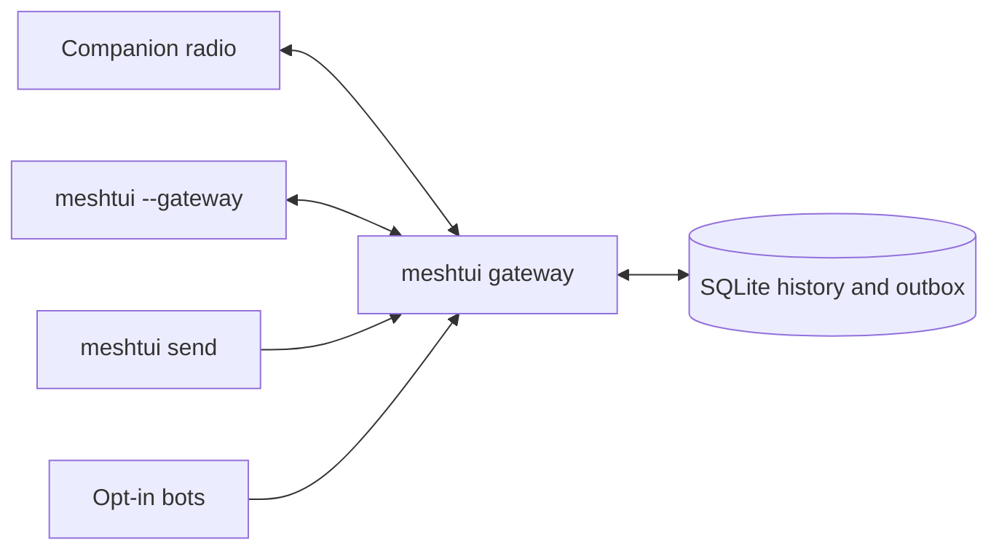

<p align="center">
  
</p>

<h1 align="center">MeshTUI</h1>

<p align="center">
  <strong>A terminal control surface for MeshCore and Meshtastic.</strong><br>
  Watch the air. Talk across the mesh. Trace routes. Admin repeaters without climbing onto the roof.
</p>

<p align="center">
  <a href="https://meshtui.com">Website</a>
  ·
  <a href="#quick-start">Quick start</a>
  ·
  <a href="#keyboard-reference">Keys</a>
  ·
  <a href="#unattended-gateway">Gateway</a>
</p>

<p align="center">
  
  
  <a href="LICENSE"></a>
</p>

[](docs/assets/meshtui-dashboard.png)

<p align="center"><em>The real Textual interface, captured with deterministic synthetic MeshCore data. The radios are fictional; the UI is not.</em></p>

MeshTUI turns a companion radio into an operator-friendly terminal application. It
normalizes MeshCore and Meshtastic traffic into one live view while keeping each
protocol's distinctive capabilities visible.

## What you can do

| | Capability |
|---|---|
| **Observe** | Follow decoded packets, SNR, hop count, node activity, telemetry, sensors, movement, and a braille-rendered map. |
| **Communicate** | Read every channel, open focused conversations, send direct messages, complete `@mentions` with Tab, and see delivery or repeat status. |
| **Understand routes** | Explore MeshCore path observations, Meshtastic traceroutes, relay dependency, and link history instead of guessing how traffic moved. |
| **Operate remotely** | Authenticate to MeshCore repeaters and room servers over RF, run console commands, and retain a redacted session log. |
| **Automate** | Leave one gateway attached to the radio, queue durable messages from local scripts, and opt in to bounded path, test, or AI bots. |
| **Investigate** | Inspect decoded fields and hex, retain SQLite history, export CSV, and audit Meshtastic traffic against upstream's published channel keys. |

## Protocol support

MeshTUI probes serial radios for MeshCore first, then falls back to Meshtastic. You
can always choose explicitly with `--protocol meshcore` or
`--protocol meshtastic`.

| Capability | MeshCore | Meshtastic |
|---|:---:|:---:|
| Dashboard, nodes, packets, chat, direct messages | ✓ | ✓ |
| Position map, telemetry, sensors, history | ✓ | ✓ |
| Channel browsing and payload-aware composer | ✓ | ✓ |
| Observed path explorer and route bot | ✓ | — |
| Message repeat attribution | ✓ | — |
| Remote repeater and room-server administration | ✓ | — |
| Traceroute, relay dependency, and mesh health | — | ✓ |
| Channel security audit | — | ✓ |

Protocol-specific features stay protocol-specific. MeshTUI does not pretend that a
MeshCore route is a Meshtastic traceroute, or that a broadcast has an end-to-end
delivery receipt.

## Remote administration

[](docs/assets/meshtui-remote-admin.png)

Press `x` to open the MeshCore administration screen. Select a repeater or room
server, enter `login <password>`, and send the console commands supported by that
node's firmware. Shortcuts request status, telemetry, neighbours, and logout.

Replies travel over LoRa, so they can take seconds or be lost. The session log
records exactly what returned and survives restarts. Text entered after `login`,
`password`, `passwd`, or `pass` is redacted before it reaches memory or SQLite.

Common commands include `ver`, `clock`, `advert`, `reboot`, `get freq`, `get tx`,
`get repeat`, `set repeat on|off`, `neighbors`, and `log start|stop`. The repeater
firmware remains the authority for the commands a particular build accepts.

## Chat that behaves like a chat client

[](docs/assets/meshtui-chat.png)

The dashboard shows an all-channel activity stream. Press `z` for the focused chat
view or `/` to jump directly to the composer. MeshTUI provides:

- separate channel and direct-message conversations;
- unread counts and channel navigation;
- Tab-completed `@[Name]` mentions, including emoji-led names;
- a live UTF-8 byte budget for the active protocol;
- direct-message acknowledgement state; and
- MeshCore repeater attribution on sent channel messages.

The composer refuses an over-limit payload without discarding the draft. The
current fallback limits are 233 bytes for Meshtastic and 133 bytes for MeshCore;
when the installed Meshtastic protobuf exposes its own limit, MeshTUI uses that
value.

## Bots without a bot-shaped security hole

[](docs/assets/meshtui-bots.png)

The unattended gateway can host three opt-in responders:

- `--pathbot CHANNEL` answers `!path` from MeshCore's recorded RF route data.
- `--testbot CHANNEL` returns the observed hop count for a field-test message.
- `--bot-channel CHANNEL` sends explicit `@ai` requests to a
  Responses-compatible text provider.

The AI router receives only the prompt, sender ID, and conversation label. It has
no tools, files, shell, radio credentials, or database history. Replies are
rate-limited, duplicate-suppressed across restarts, UTF-8 safe, and capped at three
mesh packets.

```sh
export OPENAI_API_KEY='...'

meshtui gateway --protocol meshcore --port /dev/ttyUSB0 \
  --pathbot '#bots' \
  --testbot '#testing' --testbot-location 'the suspicious rooftop' \
  --bot-channel '#bots' --ai-model gpt-5-mini
```

The path and test bots are deterministic and local; they do not need an API key.

## Quick start

The fastest way to explore MeshTUI does not require a radio:

```sh
git clone https://github.com/jsaveker/meshtui.git
cd meshtui
uv run meshtui --demo
```

[uv](https://docs.astral.sh/uv/) installs the required Python version and locked
dependencies automatically. To use real hardware, connect a companion radio over
USB and run:

```sh
uv run meshtui
```

MeshTUI auto-detects the serial device and protocol. If more than one device is
present, or you want an explicit configuration:

```sh
uv run meshtui --list-ports
uv run meshtui --port /dev/ttyUSB0 --protocol meshcore
uv run meshtui --port /dev/ttyACM0 --protocol meshtastic
```

### Install without uv

MeshTUI requires Python 3.11 or newer.

```sh
python3 -m venv .venv
source .venv/bin/activate
python -m pip install -e .
meshtui --demo
```

### Connect over TCP

Both transports accept `--host`. This is useful when the radio is positioned for
RF coverage rather than beside the operator:

```sh
meshtui --host 192.168.1.42 --protocol meshtastic
meshtui --host meshtastic.local --protocol meshtastic
meshtui --host 192.168.1.43:5000 --protocol meshcore
```

For Meshtastic, the default TCP port is 4403. Run `meshtui --list-ports` to find
serial devices and Meshtastic nodes advertising over mDNS.

### Useful launch options

```text
--demo                   run with a synthetic mesh and no radio
--gateway [SOCKET]       attach the TUI to a running local gateway
--no-store               keep the session out of SQLite
--db PATH                use a specific database
--restore-limit N        choose how many stored packets rebuild live views
--stats                   print database statistics and exit
--export TABLE:FILE      export packets, messages, or nodes to CSV
--audit                   audit captured Meshtastic channel keys and exit
--debug                   write meshtui.log
```

Run `meshtui --help`, `meshtui gateway --help`, or `meshtui send --help` for the
complete command reference.

## Unattended gateway

`meshtui gateway` is the long-running radio owner. It has no UI, reconnects after
link failure, writes history, and exposes an owner-only local Unix socket. The TUI
and local automation attach to it instead of competing for the serial port.



```sh
# Keep one process attached to the radio.
meshtui gateway --protocol meshcore --port /dev/ttyUSB0

# Inspect it or watch it through the full TUI.
meshtui gateway-status
meshtui --gateway

# Send from a local script without opening the serial device.
meshtui send channel --channel '#bots' 'backup completed; raccoon uninvolved'
meshtui send dm --to '!2935ec59' 'water sensor is dry again'

# Exit successfully only after the direct-message mesh ACK arrives.
meshtui send dm --to '!2935ec59' --wait 300 'field test 0042'
```

One logical outgoing message is written before transmission. Failed connections
leave it queued, retries retain the same message ID, and process restarts do not
erase the outbox.

Delivery states have deliberately narrow meanings:

| State | Meaning |
|---|---|
| `queued` | Durable locally; the radio has not accepted it. |
| `sent` | Accepted by the local radio. This does not prove receipt. |
| `delivered` | A direct-message end-to-end mesh acknowledgement arrived. |
| `failed` / `expired` | Retry or lifetime policy ended the attempt. |

Channel broadcasts stop at `sent`; neither protocol can prove that every listener
received one. Run the gateway under your service manager for a days-long station,
with a fixed database and socket path and serial-device permission. Only one
process can own a radio at a time.

## Keyboard reference

Press `?` inside MeshTUI for the complete, context-aware reference.

| Key | Action |
|---|---|
| `Tab` / `Shift+Tab` | Move between panes. |
| `/` | Focus the message composer. |
| `z` | Expand chat to full screen. |
| `[` / `]` | Previous or next channel. |
| `Enter` | Open node detail or inspect the selected packet. |
| `d` | Direct-message the selected node. |
| `t` | Traceroute the selected node. |
| `m` | Open the position map. |
| `v` | Open observed route paths. |
| `x` | Open MeshCore remote administration. |
| `r` | Open Meshtastic relay dependency and mesh health. |
| `a` | Open the Meshtastic channel security audit. |
| `w` | Open sensor telemetry. |
| `c` | Browse channels. |
| `p` | Pause or resume the packet feed. |
| `f` | Cycle the packet filter. |
| `s` | Cycle node sorting. |
| `G` / `End` | Follow the newest packet. |
| `Esc` | Leave the composer or close an overlay. |
| `q` | Quit. |

While the composer has focus, ordinary letters are text. Press `Esc` or `Tab`
before using a single-key screen shortcut.

### Chat commands

```text
/dm <node> <text>      direct message a short name or node ID
/trace <node> [hops]  traceroute; use 1 hop to test only the direct link
/nodes                 list known nodes
/clear                 clear the conversation view
/help                  show chat help
```

## History, exports, and privacy

By default, MeshTUI stores packets, messages, nodes, path observations, derived
metrics, the durable outbox, and redacted admin logs in:

```text
~/.local/share/meshtui/mesh.db
```

Writes run off the UI thread. On startup, stored facts and recent packets rebuild
sparklines, sensor readings, relay counters, routes, and movement trails. Each
radio's observations remain separate, because signal and hop count mean “as heard
from this station.” Use `--no-store` for an ephemeral session.

```sh
meshtui --stats
meshtui --export packets:packets.csv
meshtui --export messages:messages.csv
meshtui --export nodes:nodes.csv
```

The database can contain node identifiers, positions, signal observations, and
message content from radios your node hears. It stays on the local machine by
default. Inspect it before sharing it, even when the mesh itself is public.

The Meshtastic security audit tests only the default and shorthand keys published
by upstream. It does not brute-force private channel keys. Sender, destination,
packet ID, hop count, signal strength, and channel hash can still be visible as
radio metadata even when message content is encrypted.

## Development

The project uses a small protocol-neutral core:

- `src/meshtui/model.py` defines packets, destinations, and delivery receipts.
- `src/meshtui/service.py` owns state, durable sends, retries, and acknowledgements.
- `src/meshtui/radio.py` and `src/meshtui/meshcore_link.py` adapt the two protocols.
- `src/meshtui/gateway.py` owns the radio and local socket API.
- `src/meshtui/bot.py` implements bounded AI, path, and test routing.
- `src/meshtui/store.py` owns SQLite persistence.
- `src/meshtui/app.py` and `src/meshtui/widgets/` render the Textual UI.

Run the complete local test suite:

```sh
for test in tests/test_*.py; do
  uv run python "$test"
done

uv run python tests/smoke.py
```

`tests/smoke.py` drives the real Textual app headlessly. The focused tests cover
protocol mapping, route hashes, remote-admin isolation and redaction, channel
indices, packet rendering, reconnect behavior, durable delivery, bot limits, map
links, and gateway streaming without requiring radio hardware.

For an actual RF acceptance test, use two radios and verify both the received
message and a direct-message acknowledgement. A simulated pass proves the
software path, not coverage, antenna performance, region settings, or a live
repeater route.

## License

[MIT](LICENSE) © 2026 jsaveker.
